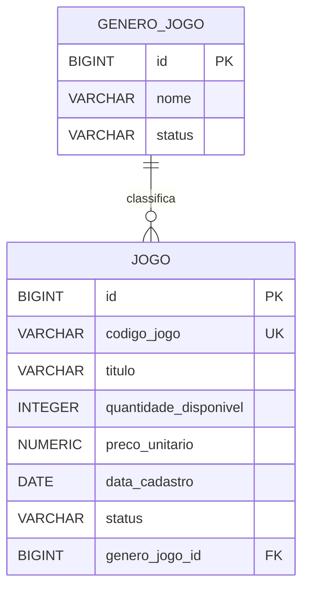

# Aula 04 — Persistência com JPA, PostgreSQL e Liquibase

## Diagrama

## Decisões de persistência

`genero_jogo` representa a entidade de classificação e `jogo` representa
a entidade principal. A relação é de um gênero para muitos jogos.

O código do jogo é único em todo o banco porque funciona como sua chave
de negócio. A chave estrangeira `genero_jogo_id` é obrigatória porque
todo jogo deve pertencer a um gênero. A exclusão usa `RESTRICT` para
impedir a remoção de um gênero que ainda possua jogos.

As colunas necessárias para construir objetos válidos usam `NOT NULL`.
Os checks impedem quantidade e preço negativos e restringem o status a
`ATIVO` ou `INATIVO`. O preço utiliza `NUMERIC(18,2)` para evitar
imprecisão monetária, enquanto a quantidade usa `INTEGER` porque jogos
são unidades indivisíveis.

## Correspondência JPA e PostgreSQL

| Atributo Java | Anotação | Coluna | Tipo | Constraint | ChangeSet |
|---|---|---|---|---|---|
| `GeneroJogo.id` | `@Id` | `id` | `BIGINT` | PK | `001-01` |
| `GeneroJogo.nome` | `@Column` | `nome` | `VARCHAR(120)` | NOT NULL | `001-01` |
| `GeneroJogo.status` | `@Enumerated` | `status` | `VARCHAR(20)` | NOT NULL, CHECK | `001-01/02` |
| `Jogo.id` | `@Id` | `id` | `BIGINT` | PK | `002-01` |
| `Jogo.codigoJogo` | `@Column` | `codigo_jogo` | `VARCHAR(50)` | NOT NULL, UNIQUE | `002-01/02` |
| `Jogo.titulo` | `@Column` | `titulo` | `VARCHAR(150)` | NOT NULL | `002-01` |
| `Jogo.quantidadeDisponivel` | `@Column` | `quantidade_disponivel` | `INTEGER` | NOT NULL, CHECK | `002-01/04` |
| `Jogo.precoUnitario` | `@Column` | `preco_unitario` | `NUMERIC(18,2)` | NOT NULL, CHECK | `002-01/05` |
| `Jogo.dataCadastro` | `@Column` | `data_cadastro` | `DATE` | NOT NULL | `002-01` |
| `Jogo.status` | `@Enumerated` | `status` | `VARCHAR(20)` | NOT NULL, CHECK | `002-01/06` |
| `Jogo.genero` | `@ManyToOne` | `genero_jogo_id` | `BIGINT` | NOT NULL, FK | `002-01/03` |

## Evidências

- profiles `dev`, `test` e `prod` configurados;
- bancos `jogos2026_dev` e `jogos2026_test` separados;
- oito changeSets registrados pelo Liquibase;
- segunda inicialização sem repetição das migrações;
- Hibernate validando o esquema;
- 17 testes executados com sucesso no PostgreSQL;
- código duplicado e quantidade negativa rejeitados pelo banco;
- nenhuma senha versionada.
